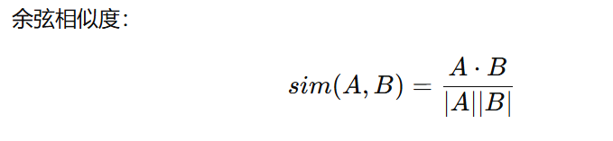
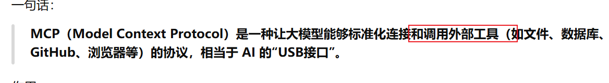
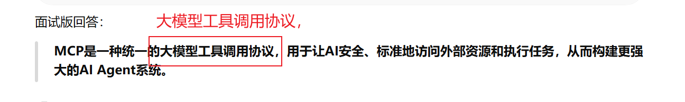

# RAG (Retrieval-Augmented Generation)

**检索，增强、生成**

>   **RAG=LLM + 知识库检索**

他让大模型 能利用外部知识库知识，而不是只依赖训练时学到的

为什么需要RAG？

因为模型学习到的知识，很有可能会过期，容易产生**幻觉**。比如CMIG期刊的最新影响因子。

什么是幻觉？

模型生成了**看似合理**，但实际上**不真实甚至完全捏造**的内容。

> 一本正经胡说八道

RAG流程： 问题-->知识库检索--->LLM--->回答


## 4个核心组件

1.Embedding模型

将输入文字（问题）变成向量。

比如：氟斑牙

↓  

```
[0.32,-.31,0.78.....]
```

向量长度可能是768,1024


2.向量数据库

存储向量

例如：

```text
论文1
论文2
论文3
```

都变成向量，保存到向量数据库。


3.检索器 Retriever 

找到**最相关**的内容。

怎么判断相关性： 两个向量做内积。



4.LLM

把检索结果喂给大模型。

大模型生成结果。

# MCP (Model Context Protocol)

模型上下文协议

**大模型工具调用协议**。传统的大模型，只会问答，不会真的帮你干活。





调用github,文件系统，数据库，浏览器等工具。
