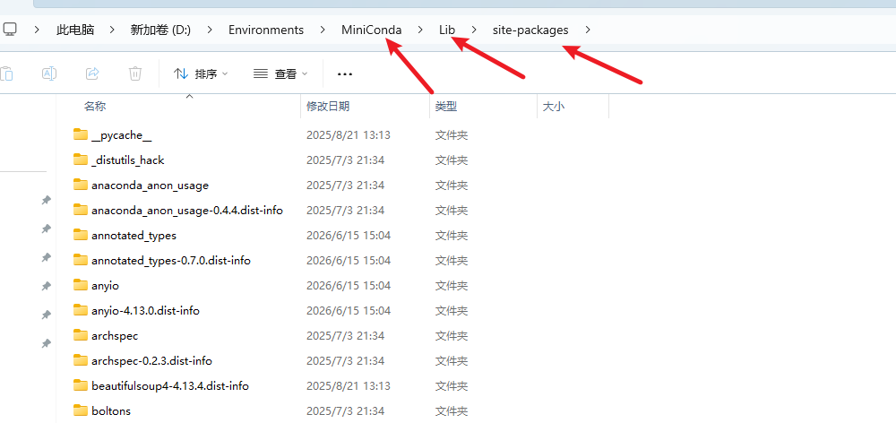
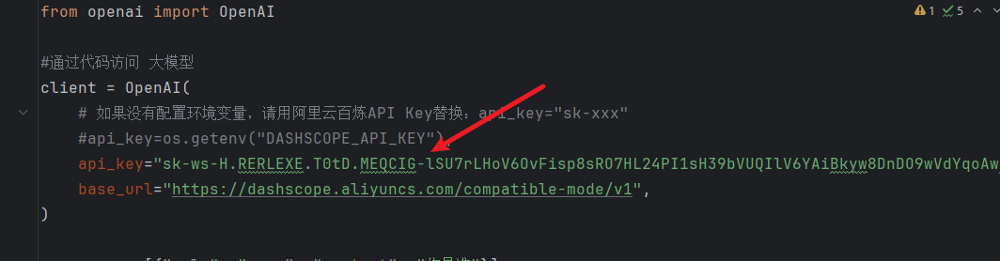
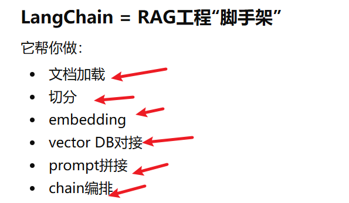
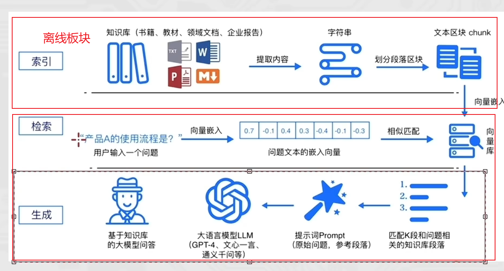
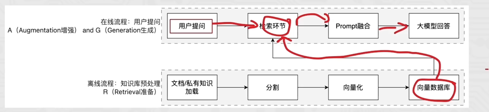
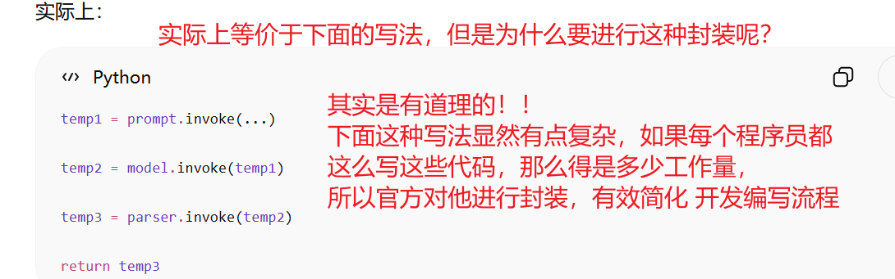
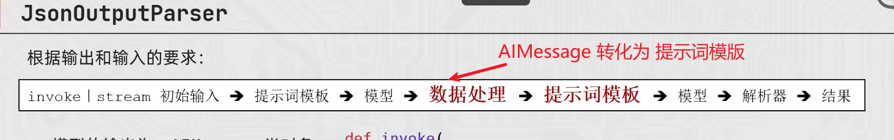

# 前置准备

## 1阿里云百联平台接入千问大模型

注册，登录，实名认证

创建APIKey,拿到接入大模型的钥匙

```
sk-ws-H.RERLEXE.T0tD.MEQCIG-lSU7rLHoV6OvFisp8sRO7HL24PI1sH39bVUQIlV6YAiBkyw8DnDO9wVdYqoAwAdvgJjt55jvfzsZcHT3QmRuFJQ
```

## 2openai库

在接入deekseek,豆包，千问，智普GLM，GPT 等大模型时，通常需要使用openai库。

openai库，本质是一个统一的客户端，用来想大模型服务器发送请求和接收响应。

他不止能 接收GPT模型。

安装命令：

```
pip install openai -i https://pypi.tuna.tsinghua.edu.cn/simple
```

-i:代表临时使用，也可以全局配置。

接入模型之后，就能通过**代码** 访问 千问大模型。

python 安装的包，全部放在这个目录下。Lib/site-packages



使用命令看一下有没有安装： openai

```bash
pip list
```

找到它的安装位置，后 重新查看pycharm解释器，路径是否正确， （base,还是其他conda环境）

用python代码 访问 大模型！！！

总结：

1.通过申请APIKEY

2.安装openai 库

3.使用阿里云百联平台官方代码，通过代码方式使用大模型。

### APIKEY 配置环境变量



像这样直接把apikey，明文写到代码中，是很不安全的，如果别别人拿到，那他也可能使用我的api,花我的钱。很不安全！！

所以我们要把apikey，设置到每个人操作系统的**环境变量**中，让程序自己读取，安全一点。

配置：

windows电脑直接搜索： 高级系统设置

在用户变量中：新建  OPENAI_API_KEY

值就是我们的apikey,

配置完成后一定要重启电脑，才会生效。

# OpenAI 库的基本使用

openai库是OpenAI 官方推出的python  SDK（软件开发工具包），

1.创建 客户端对象：OpenAI();

```
client=OpenAI (
	#一般设置为用户环境变量
	#api_key=""
	#接入模型的api接口地址
	base_url=""
)
```

2.调用模型

3.处理结果


# 提示词工程promt enginering

简单来说，就是提问工程，怎么有效的提问模型，得到我们想要的效果。

## 提示词设计技巧

1.详细的描述

2.让模型扮演某个角色

3.使用分隔符表明输入的不同部分

4.指定任务的步骤

5.给适当的例子（参考文档）

## 零样本学习

模型**没见过（不认识**）每个类别的事物，也能正确的识别或完成任务。

他是怎么做到的呢？

是通过**语义信息、建立关联**。

比如： 斑马=有黑白条纹的马

能解决什么问题：

1.标注数据稀缺 ，（医学图像）

零样本学习可以不训练样本，也能识别**新类别**

2.提高模型泛化能力

模型 不是死记硬背 特征，而是学会理解概念，可以应对新疾病


少样本学习，监督学习


# LangChain



langchain是一个**快速构建** 大模型应用的**开发框架**。有很多接口。

本质也是一个python SDK  .

安装langchain:

```
pip install langchain langchain-community langchain-ollama dashscope chromadb -i https://pypi.tuna.tsinghua.edu.cn/simple
```





## 余弦相似度

判断两个向量的相似程度

cos =1  : 表示完全一样

cos=0:  表示垂直

cos=-1 : 表示完全相反


flash: 闪光

flush: 冲洗 ，在计算机中表示**刷新**输出缓冲区的意思

```
    print(i,end="",flush=True)
```

参数 flush : 刷新输出缓冲区

默认情况下，在向显示器输出数据中，一般会有一个输出缓冲区，先向缓冲区输出数据，等缓冲区满了，再将 缓冲区的数据一次性输出到显示器，

所以：我们做实时进度条和流式输出时，需要 flush=True


## dashscope

是**阿里**旗下的一站式AI大模型服务站，方便开发者 将AI大模型接入到应用中。

## langchain链

将上一个组件的输出作为下一个组件的输入，就是langchain的链，

实现数据的自动化流转和组件的协同调用。

核心前提： **Runnable的子类**才能 入链。


## python魔法方法

前有都有双下划线的方法。

这些方法不用**用户去调用，会在特定场景下自动调用。**

```
__init__
```

会在创建对象时，自动调用初始化方法。


## Runnable 类

基本上 langchain_core 中的组件都继承了 runnable 接口。

继承了之后，才能链式调用。

为什么？

假设没有runnable:

prompt.run()

llm.chat()

parser.parse()

这样导致每个组件的接口，**没办法统一。**

所以：langchain规定：

所有组件都实现invoke()方法。方便统一调用。

### runnable核心方法：

1.invoke()  执行一次，一次性输出

2.batch() 批量执行

3.stream() 流式输出

### 最简单的runnable: runnableLambda

作用： 把函数 封装为runnable,  方便 链式调用


### runnableSequence

runnable是如何进行串联的

比如：prompt| llm|parser

| 本质上调用 魔法方法 

```
__or__()
```

返回（生成）一个 RunnableSequence 类（对象）

runnablesequence对象的结构： prompt →llms →parser ,

然后只用调用一次 invoke()




## JsonOutputParser



而提示词模版的输出要求是字典 dict,  所以我们需要把llm的输出转化为 dict. JSON 格式。

就是把 AI 输出结果，解析为JSON 结果。

## langchain 怎么实现历史对话记录

langchain本身不是让模型拥有真正的对话记忆。

而是通过chatMessageHistory 保存历史对话，每次对话时，利用 MessagesPlaceholder主动将历史消息，拼接到 提示词中，然后发送给大模型。

实际工程通常使用：  RunnableWithMessageHistory 管理不同的对话历史，并结合Redis 、Mongo DB  做持久化存储。


## Document Loader 

文档加载器

