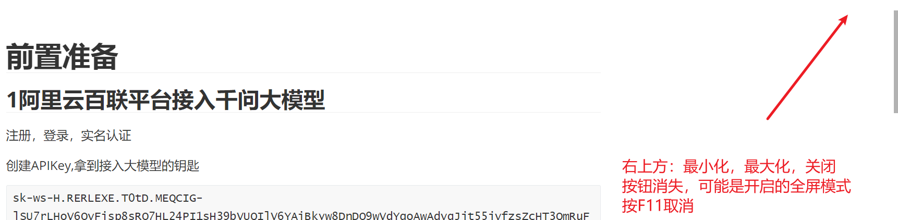

## 便携版是什么意思 portable

不用安装，下载就用。

## .msi文件是什么？

windows专用的安装包。

和.exe 文件的区别：

.exe是可执行文件，可以是安装程序也可以是普通程序，但是.msi是专用的，更专业。

## ccswith 是什么

ccswith可以帮助你在claude code/codex等多个供应商之间 **一键切换**。

## 怎么接入deepseek

1.拿到deepseek的apikey,才能接入deepseek模型到codex.

2.取官网注册拿apikey.

## 供应商是什么东西

当然是模型的供应商， 比如codex的供应商是openai, cluade code的供应商是XX， 

然后deepseek也是一个模型供应商。


## typora 中输入 > ,表示引用

>出现这个小竖线


### 论文预印版

论文**正式投稿发布**前，或者同**行评审**前，就主动公开发布在 **预印版**平台。





## UTF—8 和GBK 

utf-8:是一个国际通用的编码，同时支持，中文，英文，韩文等字符，

GBK： 是一个支持中文的编码。


## Git 推送到远程仓库

1 首先确保配置好git 环境（安装Git,配置用户名和邮箱、配置SSH Key方便本次远程连接github)

### 配置好你的本地仓库

2 进入到你的文件夹，输入：

````
git init #将本地的文件夹初始化为 git仓库
````

3 查看状态

```
git status
```

比如出现：  untracked files,   表示还未被追踪的文件

4 提交到本地仓库

```
git add .# 将当前目录下的所有文件提交到暂存区
git commit -m "messages" # 将暂存区的内容 提交到本地仓库
```


### 新建远程仓库

### 本地仓库和远程仓库建立关联


